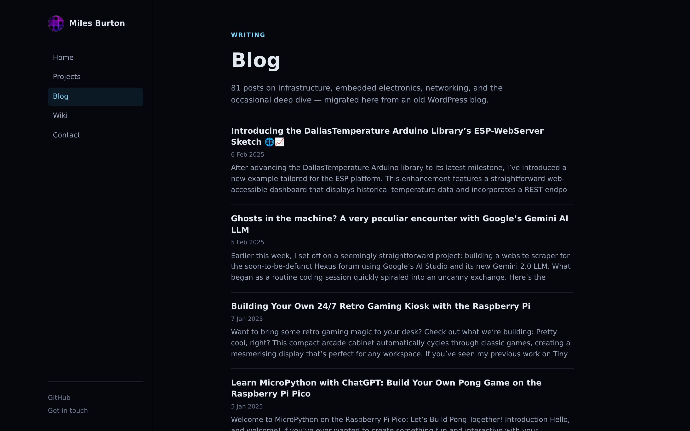
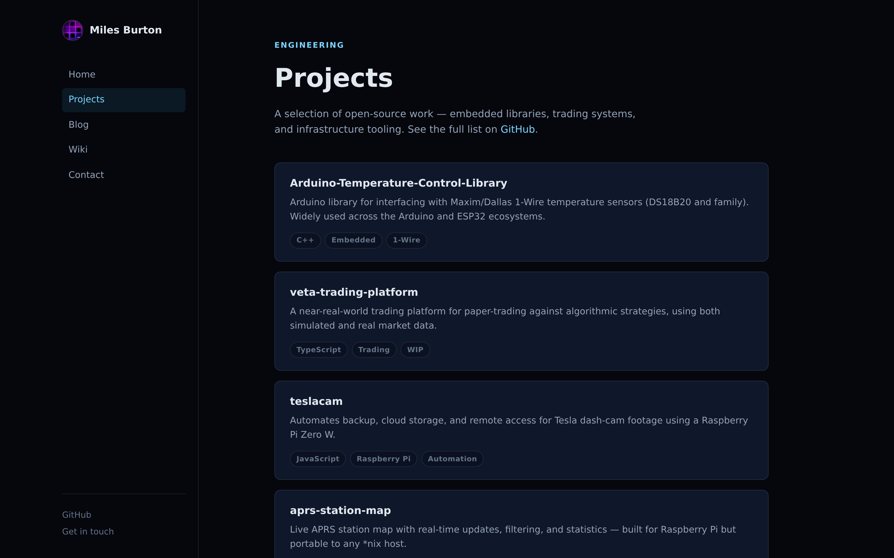
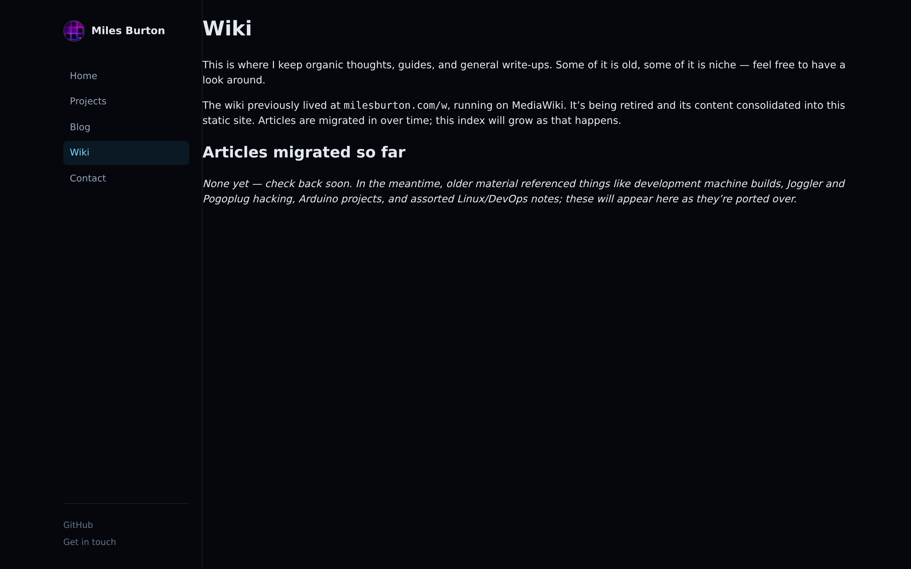

# milesburton.com

The public landing page for milesburton.com — a static Astro site that consolidates my projects, writing, and reference notes into one place, replacing what used to be a separate WordPress blog and MediaWiki install.

Deployed to GitHub Pages on every push to `main`.

## Why this migration

This site used to be three separate properties: a static homepage, a WordPress.com-hosted blog at `blog.milesburton.com`, and a self-hosted MediaWiki instance at `www.milesburton.com/w`. The goal of this migration is to shut all of that down and run everything as one static site with no server-side moving parts — nothing to patch, nothing to host, nothing to compromise.

That last point isn't hypothetical. The MediaWiki instance had been silently compromised over a long period: of roughly 139,000 pages in its database, only ~200 were genuine articles — the rest was SEO spam injected via what was almost certainly an unpatched vulnerability or open registration, backed by over 260,000 fake accounts. That wiki is being decommissioned rather than patched; only the handful of real articles are worth carrying forward, and they're being ported in by hand as time allows (see [Wiki migration status](#wiki-migration-status) below).

The WordPress blog wasn't compromised, but keeping a database-backed CMS running just to serve ~80 mostly-static posts was more infrastructure than the content justified. Its full archive — every post, category, tag, and embedded image — was pulled via the WordPress.com REST API (the public RSS feed only ever exposes the 10 most recent posts, so a plain feed scrape would have silently dropped everything older) and converted into the Astro content collection at `src/content/blog/`. That migration is complete: all posts are live under `/blog/`, and `blog.milesburton.com` can be safely retired.

### Wiki migration status

Given the spam compromise, `src/pages/wiki/Main_Page.md` is currently a placeholder rather than a pulled dump of the live wiki — pages are being ported in individually, checked against the real content, as they're migrated. `www.milesburton.com/w` should not be treated as a trustworthy source to script against in bulk.

`scripts/migrate-wiki.ts` is an early, unfinished attempt at automating this: it fetches a page's wikitext from the MediaWiki API and does a naive regex-based conversion to Markdown. Its link handling (`[[...]]` and `[url label]` syntax) doesn't hold up on real articles and produces broken Markdown links — don't treat its output as ready to publish without a manual pass, and it has no way to tell a real article from a spam page. It's kept around as a starting point, not a working pipeline.

## Pages

|                                    |                                    |
| ---------------------------------- | ---------------------------------- |
|  |  |
| **Home** — tile-based landing page with sidebar navigation | **Blog** — full archive migrated from WordPress |
|  |  |
| **Post** — individual blog entries, rendered from local content | **Projects** — open-source work pulled from GitHub |
|  | |
| **Wiki** — reference notes, being migrated in from the old MediaWiki | |

## Stack

- [Astro](https://astro.build) (static output, no server runtime)
- Content collections for blog posts (`src/content/blog`, schema in `src/content.config.ts`) — each post is a Markdown file with `title`, `date`, `slug`, `categories`, `tags`, and `excerpt` frontmatter; the body is the original post HTML with image URLs rewritten to `/blog-media/...`
- Post images live in `public/blog-media/YYYY/MM/`, resized (max width 1600px) and re-compressed from the WordPress originals — the source archive was ~226MB, the committed copy is ~27MB
- Deployed via GitHub Actions to GitHub Pages (see [.github/workflows/deploy.yml](.github/workflows/deploy.yml))

## Development

```bash
npm install
npm run dev
```

## Licence

This project is licensed under the GNU General Public License v3.0.

See [LICENSE](LICENSE) for full terms.

## Security

If you discover a security issue related to this repository, please follow the guidance in [SECURITY.md](SECURITY.md).
